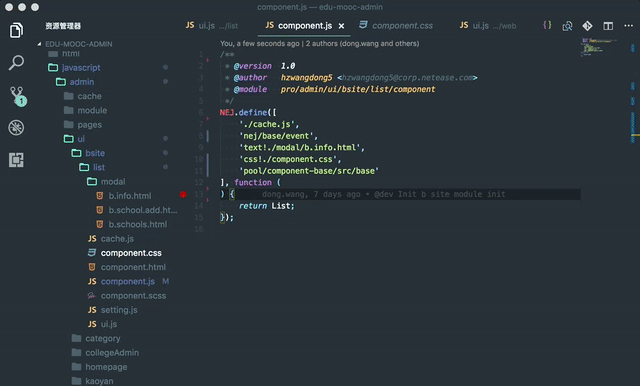

# Edu Module Peek :rocket:

> 极速定位NEJ Module，包括组件池、NEJ等等


## 安装

在VSCode中按下`F1`，输入`ext install`，然后查找`Edu Module Peek`。

## 配置

> 智能识别路径标识前缀.

```javascript
{
	"module_peek.mappings": {
            "pool":"${workspaceRoot}/src/javascript/lib",
            "nej": "${workspaceRoot}/src/javascript/lib/nej/src",
            "text!":"",
            "css!": ""
	}
}
```

## 使用




## 支持的操作系统

```
Windows, Linux, MacOS
```

## 感谢

* [VSCode](https://code.visualstudio.com/)

## 问题

### 坏消息

    项目中第一次使用时可能会比较慢，尤其当工程文件较多的时候，建立索引的时间会消耗比较大. 可惜的是这个过程当重新打开工程必然会执行一次。

### 好消息
    在Mac下这个过程会比较慢，但在Windows下整个过程非常丝滑.

### 问题跟踪

* [Go to Definition and Navigation is very slow in a large file](https://github.com/Microsoft/visualfsharp/issues/1941)


## 开源协议

[MIT](LICENSE)
